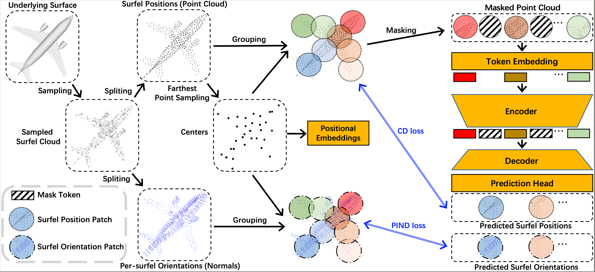

# MaskSurf

## Masked Surfel Prediction for Self-Supervised Point Cloud Learning, [arxiv](https://arxiv.org/pdf/2207.03111.pdf)

[comment]: <> ([![PWC]&#40;https://img.shields.io/endpoint.svg?url=https://paperswithcode.com/badge/masked-autoencoders-for-point-cloud-self/3d-point-cloud-classification-on-scanobjectnn&#41;]&#40;https://paperswithcode.com/sota/3d-point-cloud-classification-on-scanobjectnn?p=masked-autoencoders-for-point-cloud-self&#41;)
[comment]: <> ([![PWC]&#40;https://img.shields.io/endpoint.svg?url=https://paperswithcode.com/badge/masked-autoencoders-for-point-cloud-self/3d-point-cloud-classification-on-modelnet40&#41;]&#40;https://paperswithcode.com/sota/3d-point-cloud-classification-on-modelnet40?p=masked-autoencoders-for-point-cloud-self&#41;)

Masked auto-encoding is a popular and effective self-supervised learning approach to point cloud learning. However, most of the existing methods reconstruct only the masked points and overlook the local geometry information, which is also important to understand the point cloud data. 
In this work, we make the first attempt, to the best of our knowledge, to consider the local geometry information explicitly into the masked auto-encoding, and propose a novel Masked Surfel Prediction (MaskSurf) method. Specifically, given the input point cloud masked at a high ratio, we learn a transformer-based encoder-decoder network to estimate the underlying masked surfels by simultaneously predicting the surfel positions (i.e., points) and per-surfel orientations (i.e., normals). The predictions of points and normals are supervised by the Chamfer Distance and a newly introduced Position-Indexed Normal Distance in a set-to-set manner. Our MaskSurf is validated on six downstream tasks under three fine-tuning strategies. In particular, MaskSurf outperforms its closest competitor, Point-MAE, by 1.2\% on the real-world dataset of ScanObjectNN under the OBJ-BG setting, justifying the advantages of masked surfel prediction over masked point cloud reconstruction. 


|  |
|:-------------:|
| Fig.1: The overall framework of MaskSurf. |

## 1. Requirements
PyTorch >= 1.7.0;
python >= 3.7;
CUDA >= 9.0;
GCC >= 4.9;
torchvision;

```
pip install -r requirements.txt
```

```
# Chamfer Distance & emd
cd ./extensions/chamfer_dist
python setup.py install --user
cd ./extensions/emd
python setup.py install --user
# PointNet++
pip install "git+https://github.com/erikwijmans/Pointnet2_PyTorch.git#egg=pointnet2_ops&subdirectory=pointnet2_ops_lib"
# GPU kNN
pip install --upgrade https://github.com/unlimblue/KNN_CUDA/releases/download/0.2/KNN_CUDA-0.2-py3-none-any.whl
```

## 2. Datasets

We use ShapeNet, ScanObjectNN, ModelNet40, ShapeNetPart and S3DIS in this work. See [DATASET.md](./DATASET.md) for details.

## 3. MaskSurf Models

The results of following pretrained models are slightly different from that reported in the paper due to the randomness of results.
We report the standard deviation of results in the paper to illustrate such performance fluctuation.


|  Task | Dataset | Config | Acc.| Download|
|  ----- | ----- |-----|  -----| -----|
|  Pre-training | ShapeNet | [pretrain_MaskSurf.yaml](./cfgs/pretrain_MaskSurf.yaml)| N.A. | [here](https://drive.google.com/file/d/1tjdqdYeIE2y2zx0PXwPahBeKP3ocYPPL/view?usp=sharing) |
|  Classification | ScanObjectNN | [finetune_scan_hardest_transferring_features.yaml](./cfgs/finetune_scan_hardest_transferring_features.yaml)| 85.67%| [here](https://drive.google.com/file/d/1_Lt1MzDujGKXAI9mzEsfh6O--uK6a1BX/view?usp=sharing)  |
|  Classification | ScanObjectNN | [finetune_scan_objbg_transferring_features.yaml](./cfgs/finetune_scan_objbg_transferring_features.yaml)| 91.05% | [here](https://drive.google.com/file/d/1fhAMaQ2fZXdubng4ujEyXHC6EUdDfT2T/view?usp=sharing) |
|  Classification | ScanObjectNN | [finetune_scan_objonly_transferring_features.yaml](./cfgs/finetune_scan_objonly_transferring_features.yaml)| 89.32%| [here](https://drive.google.com/file/d/1B1HsT3OMb_UVy5sC27ae5NWZtYauKdNS/view?usp=sharing) |
|  Classification | ModelNet40 | [finetune_modelnet_transferring_features.yaml](./cfgs/finetune_modelnet_transferring_features.yaml)| 93.56%| [here](https://drive.google.com/file/d/1FVs3ztGImaO-0jgqAEXfSdOSzdUEPnna/view?usp=sharing) |
|  Classification | ShapeNet | [finetune_shapenet_non_linear_classification.yaml](./cfgs/finetune_shapenet_non_linear_classification.yaml)| 91.10%| [here](https://drive.google.com/file/d/1iTtfoRhLsDhCjViz-w_7sWeOAwN5Rw3o/view?usp=sharing) |
| Part segmentation| ShapeNetPart| [segmentation](./segmentation)| 86.12% mIoU| [here](https://drive.google.com/file/d/1jx1bUxjGHN1ptyhY1dKaTgieax1Y1cNr/view?usp=sharing) |
| Semantic segmentation| ShapeNetPart| [semantic_segmentation](./semantic_segmentation)| 88.3% OA| [here](https://drive.google.com/file/d/1ub7HgrquFUuIUKDMJs2O-jRwpHSXPfxU/view?usp=sharing) |


|  Task | Dataset | Config | 5w10s Acc. (%)| 5w20s Acc. (%)| 10w10s Acc. (%)| 10w20s Acc. (%)|
|  ----- | ----- |-----|  -----| -----|-----|-----|
|  Few-shot learning | ScanObjectNN | [fewshot_scanobjectnn_transferring_features.yaml](./cfgs/fewshot_scanobjectnn_transferring_features.yaml)| 65.3 ± 4.9 | 77.4 ± 5.2 | 53.8 ± 5.3 | 63.2 ± 2.7 | 

## 4. Running
We provide all the scripts for pre-training and fine-tuning in the [run.sh](./run.sh). 
Additionally, we provide a simple tool to collect the mean and standard deviation of results, for example: ```python parse_test_res.py ./experiments/{experiments_settting}/cfgs/ --multi-exp```

### MaskSurf Pre-training
To pretrain MaskSurf on ShapeNet training set, run the following command. If you want to try different models or masking ratios etc., first create a new config file, and pass its path to --config.

```
CUDA_VISIBLE_DEVICES=<GPU> python main.py --config cfgs/pretrain_MaskSurf.yaml --exp_name <output_file_name>
```
### MaskSurf Fine-tuning

Fine-tuning on ScanObjectNN, run:
```
CUDA_VISIBLE_DEVICES=<GPUs> python main.py --config cfgs/finetune_scan_hardest_{protocol}.yaml \
--finetune_model --exp_name <output_file_name> --ckpts <path/to/pre-trained/model>
```
Fine-tuning on ModelNet40, run:
```
CUDA_VISIBLE_DEVICES=<GPUs> python main.py --config cfgs/finetune_modelnet_{protocol}.yaml \
--finetune_model --exp_name <output_file_name> --ckpts <path/to/pre-trained/model>
```
Voting on ModelNet40, run:
```
CUDA_VISIBLE_DEVICES=<GPUs> python main.py --test --config cfgs/finetune_modelnet_{protocol}.yaml \
--exp_name <output_file_name> --ckpts <path/to/best/fine-tuned/model>
```
Few-shot learning on ModelNet40 or ScanObjectNN, run:
```
CUDA_VISIBLE_DEVICES=<GPUs> python main.py --config cfgs/fewshot_{dataset}_{protocol}.yaml --finetune_model \
--ckpts <path/to/pre-trained/model> --exp_name <output_file_name> --way <5 or 10> --shot <10 or 20> --fold <0-9>
```
Domain generalization, run:
```
CUDA_VISIBLE_DEVICES=<GPUs> python main.py --config cfgs/dg_{source}_{protocol}.yaml --finetune_model --exp_name <output_file_name> --ckpts <path/to/best/fine-tuned/model>
CUDA_VISIBLE_DEVICES=<GPUs> python main.py --config cfgs/dg_{source}2scannet_{protocol}.yaml --test --finetune_model --exp_name <output_file_name> --ckpts <./experiments/dg_{source}_{protocol}.yaml/cfgs/<path/to/best/fine-tuned/model>
```
Part segmentation on ShapeNetPart, run:
```
cd segmentation
CUDA_VISIBLE_DEVICES=<GPUs> python main.py --ckpts <path/to/pre-trained/model> --root path/to/data --learning_rate 0.0002 --epoch 300
```
Semantic segmentation on S3DIS, run:
```
cd segmentation
CUDA_VISIBLE_DEVICES=<GPUs> python main.py --optimizer_part all --ckpts <path/to/pre-trained/model> --root path/to/data --learning_rate 0.0002 
CUDA_VISIBLE_DEVICES=<GPUs> python main_test.py  --root path/to/data --visual  --ckpts <path/to/best/fine-tuned/model>
```

## 5. Visualization

Please refer to the [vis_masksurf.py](./vis_masksurf.py) for the visualization of surfels.

## Acknowledgements

Our codes are built upon [Point-MAE](https://github.com/Pang-Yatian/Point-MAE)

## Reference

```
@article{zhang2022masked,
  title={Masked Surfel Prediction for Self-Supervised Point Cloud Learning},
  author={Zhang, Yabin and Lin, Jiehong and He, Chenhang and Chen, Yongwei and Jia, Kui and Zhang, Lei},
  journal={arXiv preprint arXiv:2207.03111},
  year={2022}
}
```
